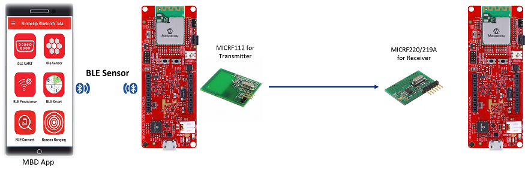

# PIC32CXBZ2_WBZ45x Sub-GHz MICRF112/114 with MICRF220/219A

> "IoT Made Easy!" 

Devices: **| PIC32CXBZ2 | WBZ45x |** 
Features: **| BLE SENSOR | Sub-GHz |**

## ⚠ Disclaimer

<b>
THE SOFTWARE ARE PROVIDED "AS IS" AND GIVE A PATH FOR SELF-SUPPORT AND SELF-MAINTENANCE. This repository contains example code intended to help accelerate client product development.  

For additional Microchip repos, see: <a href="https://github.com/Microchip-MPLAB-Harmony" target="_blank">https://github.com/Microchip-MPLAB-Harmony</a>

Checkout the <a href="https://microchipsupport.force.com/s/" target="_blank">Technical support portal</a> to access our knowledge base, community forums or submit support ticket requests.

</b>

## Contents

1. [Introduction](#step1)
1. [Contents](#step2)

## 1. Introduction<a name="step1">

This application demonstrates the use of an MICRF112 as transmitter and MICRF220/219A as receiver using ASK Modulation interfaced with the WBZ451 Curiosity board to control the RGB LED of the WBZ451 Curiosity board on receiver part. This LED can be controlled by Microchip Bluetooth Data [(MBD)](https://play.google.com/store/apps/details?id=com.microchip.bluetooth.data&hl=en_IN&gl=US) application through Bluetooth Low Energy (BLE) using [BLE Sensor application](https://github.com/Microchip-MPLAB-Harmony/wireless_apps_pic32cxbz2_wbz45/tree/master/apps/ble/advanced_applications/ble_sensor).

| Note: For more details on the working of BLE sensor application, refer to the link [here](https://github.com/Microchip-MPLAB-Harmony/wireless_apps_pic32cxbz2_wbz45/tree/master/apps/ble/advanced_applications/ble_sensor) !! |
| --- |

The [BLE Sensor application](https://github.com/Microchip-MPLAB-Harmony/wireless_apps_pic32cxbz2_wbz45/tree/master/apps/ble/advanced_applications/ble_sensor) is implemented on both transmitter part and receiver part to control the RGB LED. The RGB values are received from the (MBD) application using BLE Sensor application and then it is transmitted through MICRF112. The MICRF220/219A receives the RGB values and updates the RGB LED.

The above video shows the working of MICRF112(433MHz) and MICRF219A(433MHz).

## 2. Contents<a name="step2">

1. [WBZ451_MICRF112/114](https://github.com/MicrochipTech/PIC32CXBZ2_WBZ45x_Sub-GHz_MICRF112_114_MICRF220_219A_BLE_SENSOR/tree/main/WBZ451_MICRF112_114)

2. [WBZ451_MICRF220/219A](https://github.com/MicrochipTech/PIC32CXBZ2_WBZ45x_Sub-GHz_MICRF112_114_MICRF220_219A_BLE_SENSOR/tree/main/WBZ451_MICRF220_219A)

