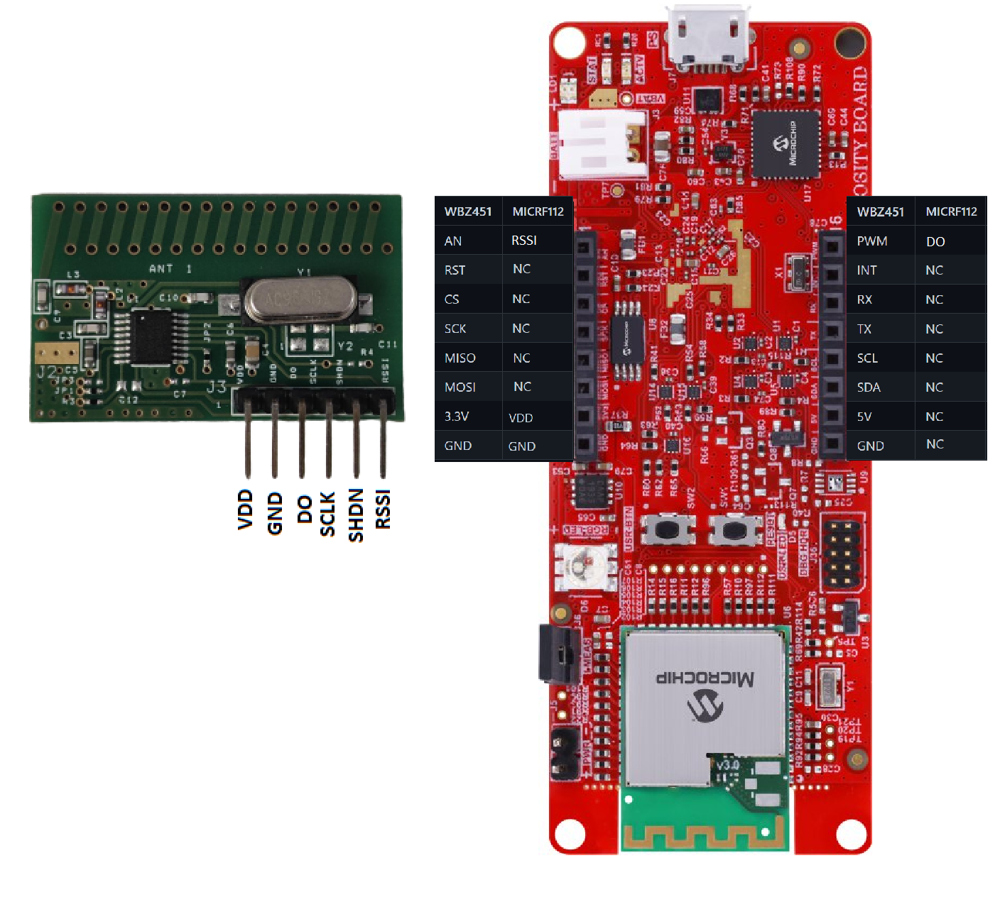
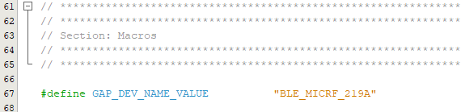

# PIC32CXBZ2_WBZ45x_Sub-GHz_MICRF220_219A

> "IOT Made Easy!" 

Devices: **| PIC32CXBZ2 | WBZ45x |** 
Features: **| BLE SENSOR | MICRF220-433-EV | MICRF219A-433-EV |**

## ⚠ Disclaimer

<b>
THE SOFTWARE ARE PROVIDED "AS IS" AND GIVE A PATH FOR SELF-SUPPORT AND SELF-MAINTENANCE. This repository contains example code intended to help accelerate client product development.  

For additional Microchip repos, see: <a href="https://github.com/Microchip-MPLAB-Harmony" target="_blank">https://github.com/Microchip-MPLAB-Harmony</a>

Checkout the <a href="https://microchipsupport.force.com/s/" target="_blank">Technical support portal</a> to access our knowledge base, community forums or submit support ticket requests.

</b>

## Contents

1. [Introduction](#step1)
1. [Bill of materials](#step2)
1. [Hardware Setup](#step3)
1. [Software Setup](#step4)
1. [Harmony MCC Configuration](#step5)
1. [Board Programming](#step6)
1. [Run the demo](#step7)

## 1. Introduction<a name="step1">

This application demonstrates the use of an MICRF22-433MHz as receiver using ASK Modulation interfaced with the WBZ451 Curiosity Board to control the RGB LED of the WBZ451 Curiosity board with the data received from the MICRF112.

## 2. Bill of materials<a name="step2">

| TOOLS | QUANTITY |
| :- | :- |
| [PIC32CX-BZ2 and WBZ451 Curiosity Development Board](https://www.microchip.com/en-us/development-tool/EV96B94A) | 1 |
| [MICRF112-433 EVALBOARD](https://www.microchip.com/en-us/development-tool/MICRF112-433-EV) | 1 |

## 3. Hardware Setup<a name="step3">

- Connect the MICRF112-433 EVALBOARD with the WBZ451 CURIOSITY BOARD using the below table.

| MICRF112 | WBZ451		   | Description |
| :- | :- | :- |
| J1-1     |    3.3V       |     VDD     |
| J1-2     | 	 GND 	   |     GND     |
| J1-3     |  INT		   |     Data Out|
| J2-1     |  RST          |   Enable    |
| J2-2     |       GND     |     GND     |
| J2-3     |    N/C        |    N/C      |

 

## 4. Software Setup<a name="step4">

- [MPLAB X IDE ](https://www.microchip.com/en-us/tools-resources/develop/mplab-x-ide#tabs)

    - Version: 6.05
	- XC32 Compiler v4.10
	- MPLAB® Code Configurator v5.1.17
	- PIC32CX-BZ_DFP v1.0.107
	- MCC Harmony
	  - csp version: v3.13.1
	  - core version: v3.11.1
	  - CMSIS-FreeRTOS: v10.4.6
	  - wireless_pic32cxbz_wbz: v1.0.0
	  - wireless_ble: v1.0.0	  
	  - dev_packs: v3.13.1
	  - wolfssl version: v4.7.0
	  - crypto version: v3.7.6
	    

- [Microchip Bluetooth Data (MBD) iOS/Android app](https://play.google.com/store/apps/details?id=com.microchip.bluetooth.data&hl=en_IN&gl=US)

- [MPLAB X IPE v6.05](https://microchipdeveloper.com/ipe:installation)

## 5. Harmony MCC Configuration<a name="step5">

### Getting started with MICRF112 with WBZ451 CURIOSITY BOARD.

| Tip | New users of MPLAB Code Configurator are recommended to go through the [overview](https://onlinedocs.microchip.com/pr/GUID-1F7007B8-9A46-4D03-AEED-650357BA760D-en-US-6/index.html?GUID-AFAB9227-B10C-4FAE-9785-98474664B50A) |
| :- | :- |

**Step 1** - Connect the WBZ451 CURIOSITY BOARD to the device/system using a micro-USB cable.

**Step 2** - This application is built by using [WBZ45x BLE Sensor with ATTINY3217 Touch Demo](https://github.com/MicrochipTech/PIC32CXBZ2_WBZ45x_BLE_SENSOR_Touch_ATtiny3217) as the building block. The project graph of the WBZ45x BLE Sensor with ATTINY3217 Touch Demo application is shown below.

**Step 3** - In MCC harmony project graph add the tc0 from device resources->peripherals->TC and configure as shown below.

**Step 4** - In MCC harmony project graph select the Pin Configurations from plugins and configure as shown below.

**Step 5** - The project graph after making the configurations is shown below.

**Step 6** - [Generate the code](https://onlinedocs.microchip.com/pr/GUID-A5330D3A-9F51-4A26-B71D-8503A493DF9C-en-US-1/index.html?GUID-9C28F407-4879-4174-9963-2CF34161398E).

**Step 7** - To Add the Header files. Right click the Header Files and select "Add Existing items" to add the files from [micrf](https://github.com/MicrochipTech/PIC32CXBZ2_WBZ45x_Sub-GHz_MICRF112_114_MICRF220_219A_BLE_SENSOR/tree/main/WBZ451_MICRF112_114/micrf112) folder.

**Step 8** - To Add the Source files. Right click the Source Files and select "Add Existing items" to add the files from [micrf](https://github.com/MicrochipTech/PIC32CXBZ2_WBZ45x_Sub-GHz_MICRF112_114_MICRF220_219A_BLE_SENSOR/tree/main/WBZ451_MICRF112_114/micrf112) folder.

**Step 9** - In your MPLAB Harmony v3 based application go to "firmware\src" to Copy and paste the app.h and app.c files from the given location.

- [app.h](https://github.com/MicrochipTech/PIC32CXBZ2_WBZ45x_Sub-GHz_MICRF112_114_MICRF220_219A_BLE_SENSOR/blob/main/WBZ451_MICRF112_114/firmware/src/app.h)

- [app.c](https://github.com/MicrochipTech/PIC32CXBZ2_WBZ45x_Sub-GHz_MICRF112_114_MICRF220_219A_BLE_SENSOR/blob/main/WBZ451_MICRF112_114/firmware/src/app.c)

**Step 10** - In your MPLAB Harmony v3 based application go to "firmware\src\app_ble\app_ble.c" and do the following changes.

**Step 11** - In your MPLAB Harmony v3 based application go to "firmware\src\app_ble_sensor.c" and do the following changes.

**Step 12** - Clean and build the project. To run the project, select "Make and program device" button.

## 6. Board Programming<a name="step6">

## Programming hex file:

### Program the precompiled hex file using MPLAB X IPE

- The Precompiled hex file is given in the hex folder.
Follow the steps provided in the link to [program the precompiled hex file](https://microchipdeveloper.com/ipe:programming-device) using MPLABX IPE to program the pre-compiled hex image. 

### Build and program the application using MPLAB X IDE

The application folder can be found by navigating to the following path: 

- "WBZ451_MICRF112_114/firmware/WBZ451_MICRF112_114.X"

Follow the steps provided in the link to [Build and program the application](https://github.com/Microchip-MPLAB-Harmony/wireless_apps_pic32cxbz2_wbz45/tree/master/apps/ble/advanced_applications/ble_sensor#build-and-program-the-application-guid-3d55fb8a-5995-439d-bcd6-deae7e8e78ad-section).

## 7. Run the demo<a name="step7">

- After programming the board, the expected application behavior is shown in the below [video](https://github.com/MicrochipTech/PIC32CXBZ2_WBZ45x_BLE_UART_E_PAPER_Display/blob/main/docs/Working_Demo.gif).

